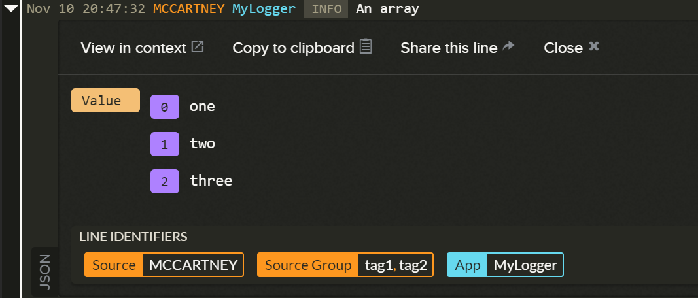

# RedBear.LogDNA.Extensions.Logging
[LogDNA](https://logdna.com) provider for [Microsoft.Extensions.Logging](https://www.nuget.org/packages/Microsoft.Extensions.Logging) written in .NET Standard 2.0.

> If you're looking to integrate with **ASP.NET Core**, take a look at the [README for `RedBear.LogDNA.Extensions.Logging.Web`](https://github.com/RedBearSys/RedBear.LogDNA.Extensions.Logging.Web) instead.

## Installation

```
Install-Package RedBear.LogDNA.Extensions.Logging
```

## Configuring the provider

To add the LogDNA provider in **.NET Core 2.0+**:

```csharp
public void ConfigureServices(IServiceCollection services)
  {
      services.AddLogging(loggingBuilder =>
      	loggingBuilder.AddLogDNA("ingestion_key"));
      
      // Other services ...
  }
```


## Optional AddLogDNA()  parameters

The following optional parameters exist on `AddLogDNA()`:

* `logLevel` - to set the default log level (default is `Warning`);
* `options` - to pass in additional configuration options (see next section).

```csharp
loggerfactory.AddLogDNA("ingestion_key", LogLevel.Debug);
```

## LogDNAOptions Class

The `AddLogDNA()` method has an override that takes an instance of a `LogDNAOptions` class:

```csharp
var options = new LogDNAOptions("ingestion_key");
options.LogLevel = LogLevel.Warning;
options.HostName = "MyHost";
options.Tags = new [] { "one", "two" };
options.MessageDetailFactory = new MessageDetailFactory();

loggerFactory.AddLogDNA(options);
```

The `LogDNAOptions` class has the following properties:

* `LogLevel` - to set the default log level (default is `Warning`);
* `HostName` - used to override the machine's hostname. Defaults to `Environment.MachineName`;
* `Tags` - to be associated with the host;
* `MessageDetailFactory` - see next section.

Additionally, different log levels can be set for different namespaces using the `.AddNamespace(namespace, level)` method:

```csharp
// Would apply to all log names starting with "MyApp." - e.g. MyApp.Services, MyApp.Models, etc
options.AddNamespace("MyApp.", LogLevel.Debug);
```

It is recommended to set the default log level (`options.LogLevel`) to `Warning` and then set a lower log level for your own code using `AddNamespace()`.

## MessageDetail class and IMessageDetailFactory

A `MessageDetail` class is serialised to create a JSON message for LogDNA to ingest:

```json
{
  message : "This is my messsage",
  level : "WARN",
  Value : {
    Foo : "foo",
    Bar : "bar"
  }
}
```

Each new instance of a `MessageDetail` class is produced by an implementation of `IMessageDetailFactory`. The default implementation is `MessageDetailFactory`.

The contents of the `MessageDetail` class can be customised by:

1. Creating a class that inherits from `MessageDetail`; and
2. Creating a new implementation of `IMessageDetailFactory` that creates instances of this class and populates any additional properties.

For example, the ASP.NET Core implementation of this log provider uses this approach to:

* implement a `WebMessageDetail` class that adds a `TraceId` property to the `MessageDetail` base class (in addition to other properties);
* implement a `WebMessageDetailFactory` that populates the `TraceId` property with the value of `HttpContextAccessor.TraceIdentifier`.

## Enforcing JSON serialisation of objects

The Microsoft logging framework will occasionally try and use its own form of serialisation, typically when dealing with `IEnumerable<>` objects.

To ensure that the original object is serialised into JSON and that a value appears as follows in LogDNA, use the `Wrapper` class.



```csharp
var array = new string[] { "one", "two", "three" };
logger.LogInformation("An array", new Wrapper(array));
```

The logger will *unwrap* the object prior to serialisation.

## Notes

Please remember that indexing of log entries only happens on paid accounts. This means you **won't** see JSON representations of objects or coloured highlighting of `INFO`, `WARN`, etc, if you are using a free account.

Also, please remember LogDNA's [standard service limits for ingestion](https://docs.logdna.com/docs/ingestion#section-service-limits).

